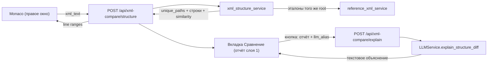

# Структурное сравнение XML и подсветка уникальности

## Что делаем

Без классического двухпанельного diff. Вместо этого: считаем "структурную сигнатуру" текущего документа, сравниваем со ВСЕМИ эталонами того же корневого элемента, находим уникальные пути элементов (которых нет ни в одном эталоне) и подсвечиваем их прямо в правом редакторе Monaco. Плюс краткий отчёт: ближайший эталон и оценка похожести (Jaccard).

"Семантичность" (игнор порядка атрибутов, пробелов, значений) заложена в самой сигнатуре — сравниваются только структурные пути тегов.

## Двухслойная архитектура

- Слой 1 (ядро, всегда): детерминированные алгоритмы — уникальные пути, подсветка, Jaccard/ближайший эталон. Быстро, бесплатно, воспроизводимо, работает офлайн.
- Слой 2 (опция, по кнопке): ИИ-объяснение поверх готового результата слоя 1. LLM НЕ ищет различия сам — он получает уже посчитанный список `unique_paths` + ближайший эталон + фрагменты уникальных элементов и возвращает человекочитаемое объяснение и оценку значимости (критично / косметика / вероятная опечатка в имени тега). ИИ вызывается только по явному действию пользователя, поэтому не влияет на стоимость и детерминизм базового сценария.

## Алгоритм (backend)

Сигнатура документа = множество структурных путей элементов: цепочка тегов от корня без индексов и namespace, напр. `PayDoc/client/contact`.

- `signature(xml)` -> `set[str]` путей + для каждого элемента его `sourceline` (для подсветки). Namespace обрезается как в существующем `_peek_root_element`.
- Эталоны берём через существующий `reference_xml_service`: находим корневой тег текущего XML, затем все категории/документы с тем же корневым элементом (`list_categories(root_element=...)` -> `list_documents` -> `load_document`).
- `union_paths` = объединение путей всех эталонов; `per_ref_paths` — по каждому эталону.
- `unique_paths = current_paths - union_paths`.
- Для подсветки: среди уникальных элементов помечаем "верхние" точки расхождения (у которых родительский путь НЕ уникален) и отдаём диапазон строк поддерева `[sourceline .. max(sourceline потомков)]` (через `element.iter()`), чтобы подсветить весь новый блок.
- Похожесть: `Jaccard(current_paths, ref_paths)` по каждому эталону -> сортировка, `closest`.

## Поток данных

## Backend

- Новый [backend/app/services/xml_structure_service.py](backend/app/services/xml_structure_service.py): `extract_paths(xml_text)`, `compute_highlight_ranges(xml_text, unique_paths)`, `compare_structure(root, xml_text)` -> отчёт. Использует `lxml` (`sourceline`) и `reference_xml_service`.
- Новый [backend/app/api/routes/xml_compare.py](backend/app/api/routes/xml_compare.py): `POST /xml-compare/structure` (body `{xml_text}`) -> `{root_element, references_count, is_unique, unique_paths:[...], highlight_ranges:[{start_line, end_line, path}], similarities:[{category, doc_id, title, score}], closest}`. Обработка: библиотека не настроена -> 503; нет эталонов для root -> пустой отчёт с флагом; ошибка парсинга -> 400.
- Правка [backend/app/main.py](backend/app/main.py): импорт и `app.include_router(xml_compare.router, prefix="/api")`.
- Тесты [backend/tests/test_xml_structure_service.py](backend/tests/test_xml_structure_service.py): сигнатура игнорирует порядок атрибутов/пробелы; уникальные пути; Jaccard; строки подсветки.

## Backend — слой 2 (ИИ)

- Правка [backend/app/services/llm_service.py](backend/app/services/llm_service.py): новый метод `LLMService.explain_structure_diff(...)`, использующий существующий `_chat_completion`. Вход: `root_element`, `unique_paths`, `closest` (title + score), короткие XML-фрагменты уникальных элементов (обрезанные по длине). Отдельный system-prompt (роль: QA-ревьюер XML; вернуть краткое объяснение и пометку значимости: критично / косметика / вероятная опечатка). Возвращает текст (без markdown-требований к XML, обычный текст/пункты).
- Правка [backend/app/api/routes/xml_compare.py](backend/app/api/routes/xml_compare.py): эндпоинт `POST /xml-compare/explain` (body: `{root_element, unique_paths, closest, snippets, llm_alias?}`), `Depends(get_current_user)`, вызывает `LLMService(user, alias=llm_alias).explain_structure_diff(...)`. Обработка: LLM не настроен -> 503 с понятным сообщением; ошибки LLM -> 502/400. Ничего не отправляем в LLM, если `unique_paths` пуст.
- Тесты: юнит на сборку промпта/усечение фрагментов (без реального сетевого вызова, замокать `_chat_completion`).

## Frontend

- Новый [frontend/src/api/xmlCompare.js](frontend/src/api/xmlCompare.js): `analyzeStructure(xmlText)`.
- Правка [frontend/src/components/XmlEditor.vue](frontend/src/components/XmlEditor.vue): проп `uniqueRanges`; применение Monaco decorations (подсветка строк + маркер в glyph margin + hover с путём) через `deltaDecorations`/`createDecorationsCollection`; авто-сброс при `content-change` (строки сдвигаются); `defineExpose` метода очистки. CSS-класс подсветки в `<style>` (не scoped, т.к. Monaco рендерит вне scope) или через `monaco.editor` inline className.
- Новый [frontend/src/components/generator/GeneratorCompareTab.vue](frontend/src/components/generator/GeneratorCompareTab.vue): кнопка "Проверить уникальность", статус, ближайший эталон + % похожести, число эталонов, список уникальных путей (клик -> прыжок к строке через уже существующий `xmlEditorRef.goToPosition`).
- Новый composable [frontend/src/composables/generator/useGeneratorCompare.js](frontend/src/composables/generator/useGeneratorCompare.js): состояние отчёта, `runCompare()` (берёт `getEditorXmlText()`), маппинг `highlight_ranges` -> проп для XmlEditor.
- Правка [frontend/src/composables/generator/useGeneratorTabs.js](frontend/src/composables/generator/useGeneratorTabs.js): добавить вкладку `compare` в `leftTabs`/`TAB_ORDER` (label "Сравнение").
- Правка [frontend/src/composables/generator/useGenerator.js](frontend/src/composables/generator/useGenerator.js): подключить `useGeneratorCompare` и пробросить наружу.
- Правка [frontend/src/views/GeneratorView.vue](frontend/src/views/GeneratorView.vue): отрисовать `GeneratorCompareTab` при `activeTab==='compare'` и передать `:unique-ranges` в `XmlEditor`.

## Frontend — слой 2 (ИИ)

- Правка [frontend/src/api/xmlCompare.js](frontend/src/api/xmlCompare.js): `explainStructure({ rootElement, uniquePaths, closest, snippets, llmAlias })` -> `POST /xml-compare/explain`.
- Правка [frontend/src/components/generator/GeneratorCompareTab.vue](frontend/src/components/generator/GeneratorCompareTab.vue): кнопка "Объяснить расхождения (ИИ)" (активна только когда есть уникальные пути), состояние загрузки/ошибки, блок с текстом объяснения от ИИ под алгоритмическим отчётом.
- Правка [frontend/src/composables/generator/useGeneratorCompare.js](frontend/src/composables/generator/useGeneratorCompare.js): `runExplain()` (берёт результат слоя 1 + текущий `llmAlias` из mapping-композабла), состояние `aiExplanation`, `aiLoading`, `aiError`.
- `llmAlias` уже доступен в [useGenerator.js](frontend/src/composables/generator/useGenerator.js) (`mapping.llmAlias`) — пробросить в compare-композабл.

## UX-детали

- Подсветка: фон строки (мягкий акцент) + маркер в glyph margin + hover "Уникальный путь: PayDoc/.../X (нет ни в одном эталоне)".
- Отчёт наверху вкладки: "Уникален по структуре: N новых путей" или "Совпадает по структуре с эталонами"; "Ближайший эталон:  — 87%".
- Если эталонов для корневого элемента нет — сообщение об этом (сравнивать не с чем).
- ИИ-объяснение — отдельным блоком под отчётом, только по кнопке; если LLM не настроен, кнопка неактивна с подсказкой.

## Проверка

- Backend: `pytest backend/tests/test_xml_structure_service.py`.
- Frontend: ручная проверка — загрузить XML, открыть вкладку "Сравнение", нажать "Проверить уникальность", увидеть подсветку новых элементов и % похожести; правка текста снимает подсветку.
- ИИ-слой: при настроенном LLM нажать "Объяснить расхождения (ИИ)" -> появляется текстовое объяснение; при ненастроенном LLM кнопка неактивна/понятная ошибка.

